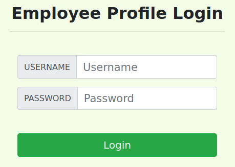
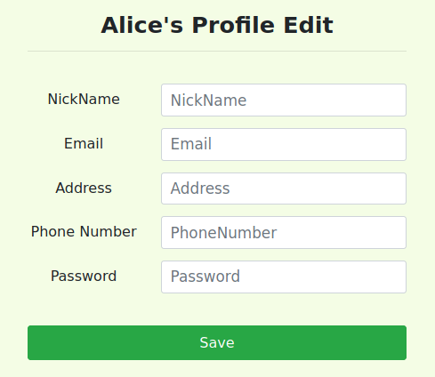

# {{page.labprefix}}: {{page.labtitle}}
{:.pb-4}

## {{page.labtitle}}
{:.titletext}
Adapted from SEED Labs: A Hands-on Lab for Security Education.
{:.subtitletext}

SQL injection is a code injection technique that exploits vulnerabilities in the interface between web applications (web apps) and databases.
The vulnerability is present when user inputs are not properly handled within the web app before being sent to a back-end database.

Many web apps take inputs from users, and then use these inputs to construct SQL queries, which retrieve information from a database.
Web apps also use SQL queries to store information in the database.
These are common practices in the development of web apps.
When SQL queries are not carefully constructed, SQL injection vulnerabilities can occur.
SQL injection is one of the most common attacks on web apps.

In this lab, we have created a web app that is vulnerable to SQL injection attacks.
Our web app includes examples of common mistakes made by many web developers.
Your goal is to find ways to exploit these SQL injection vulnerabilities,
demonstrate the damage that can be done by these attacks,
and master the techniques that can help defend against these types of attacks.

This lab covers the following topics:

- Various SQL statements: `SELECT`, `UPDATE`, etc.
- SQL Injection strategies
- An effective SQL Injection countermeasure: prepared statements

### Resources

- Code related to this lab can be found in `04_sqli/` of our [class's GitHub repository](https://github.com/traviswpeters/cs476-code).
<!-- - [How the Internet Works in 5 Minutes (YouTube)](https://www.youtube.com/watch?v=7_LPdttKXPc) -->
- [How Does the Internet Work? (YouTube)](https://www.youtube.com/watch?v=x3c1ih2NJEg)
- [How the Internet works (MDN Web Docs)](https://developer.mozilla.org/en-US/docs/Learn/Common_questions/How_does_the_Internet_work)
- [How the Web works (MDN Web Docs)](https://developer.mozilla.org/en-US/docs/Learn/Getting_started_with_the_web/How_the_Web_works)
<!-- - [HTTP — An Application-Level Protocol](https://dev.opera.com/articles/http-basic-introduction/) -->
- [HTTP Tutorials (MDN Web Docs)](https://developer.mozilla.org/en-US/docs/Web/HTTP)
- [PHP Manual (php.net)](https://www.php.net/manual/en/index.php)
- [MySQL API (php.net)](https://www.php.net/manual/en/book.mysql.php)
- [Getting Started with Burp Suite](https://medium.com/swlh/getting-started-with-burp-suite-on-ubuntu-3c1e665122a3)
- Chapter 12 in the [SEED Textbook]({{site.data.settings.textbookseedlink}}).

<!-- BEGIN Special Section (Use Bootstrap "Card" Styles). This is nice for formatting background, setup, special instructions, etc. -->
<div class="card bg-secondary border-primary" markdown="1">
<div class="card-body" markdown="1">

## Environment Setup

We have developed a web app for this lab, which runs inside docker containers.
There are two containers in the lab setup, one for hosting the web app, and the other for hosting the database.

### DNS Settings

The IP address for the web app container is `10.9.0.5`,
and the URL for the web app is: `http://www.seedlabsqlinjection.com`
Your VM should already be configured to have this hostname/IP address mapping in the `/etc/hosts` file:

```
10.9.0.5        www.seedlabsqlinjection.com
```

If you experience issues trying to address the web app by its human-readable hostname, please verify your settings.
If you need to update this information, add the above entry to the `/etc/hosts` file.
(You need root privileges to modify this file.)

### Container Setup and Commands



### MySQL Database



### The Web Application

We have created a web app, which is a simple employee management application.
Employees can view and update their personal information in the database through this web app.
There are two main roles in this web app:
`Administrator` is a privileged role and can manage each individual employees' profile information;
`Employee` is a normal role and can view or update only their own profile information.
All employee information is described in a single table stored within the database.
(You will get a chance to explore the format of this table in Task 1.)

### Employee Credentials

At various times throughout this lab it may be helpful to know the credentials (username / password) of certain employees:

- Admin / seedadmin
- Alice / seedalice
- Boby / seedboby
- Ryan / seedryan
- Samy / seedsamy
- Ted / seedted

### Validating Your SQL Injection String ("Payload")

In real-world applications, it may be hard to check whether your SQL injection attack contains syntax errors
(servers typically will not return any meaningful error messages if your injected payload raises errors).
To validate your payload, you can copy SQL statements from PHP source code to the MySQL console and test them there.

Assume you have the following SQL statement, and the injection string is `' or 1=1;#`.

```sql
SELECT * from credential
WHERE name='$name' and password='$pwd';
```

You can replace the value of `$name` with your payload and test it using the MySQL console.
This approach can help you construct a valid payload before launching the real attack.

</div>
</div>
<!-- END Special Section -->

## Lab Tasks
{:.titletext}
This lab has been tested on the pre-built SEED VM (Ubuntu 20.04 VM).
{:.subtitletext}

### Task 1: Get Familiar with SQL Statements

The objective of this task is to get familiar with SQL commands by experimenting within the provided database.
The data used by our web app is stored in a MySQL database, which is hosted on our MySQL container.
We have created a database called `sqllab_users`, which contains a table called `credential`.
The table stores the personal information (e.g., eid, password, salary, ssn, etc.) of every employee.
In this task, you will interact with this database from the `mysql` command line interface (CLI) to get familiar with SQL queries.

First, make sure your containers are running (see the "Environment Setup" section above).

Next, get a shell on the MySQL container:

```bash
$ dockps
# ...ids of containers...
$ docksh <id-of-mysql-container>
```

Then start the `mysql` client program to interact with the database.
The username is `root` and password is `dees`.

```bash
# Inside the MySQL container
$ mysql --user=root --password=dees
```

After you log in, you can create a new database or use an existing one.
You can see which databases currently exist using the `show databases` command.
We have already created the `sqllab_users` database for you, so for this task you just need to load this existing database using the `use` command.
To show what tables exist within the `sqllab_users` database,
you can use the `show tables` command to print out all the tables of the currently selected database.

After running the commands above, you need to use a SQL command to print all the information for the employee Alice.

Please provide proof of your results (e.g., command line output, screenshot).

### Task 2: A SQL Injection Attack on a SELECT Statement

A SQL injection is basically a technique through which attackers can execute their own (malicious) SQL statements;
the input, which is specially crafted to inject attacker-chosen SQL statements, is generally referred to as the _payload_.
Through the injected SQL statements, attackers can steal information from the victim database,
or even worse, they may be able to make changes to the database (e.g., update or delete information).
Our employee management web application has SQL injection vulnerabilities that mimic the mistakes frequently made by web app developers.

To explore SQL injection vulnerabilities in this task, we will use the login page found at [http://www.seedlabsqlinjection.com/](http://www.seedlabsqlinjection.com/).
The login page is shown in the figure below.
As is typical in authentication, the web app prompts users to provide a username and a password.
The web app then authenticates users based on these two pieces of information.
Presumably, only employees who know their own username and password should be able to log in.
_**Your objective**_ throughout this task is to exploit a SQL injection vulnerability in the login page
to successfully log into the web app without knowing any valid employee credentials.


{:.text-center .m-3}

<!-- BEGIN Special Section (Use Bootstrap "Card" Styles). This is nice for formatting background, setup, special instructions, etc. -->
<div class="card bg-secondary border-primary p-0 m-3" markdown="1">
<div class="card-body pb-0 pt-0 m-0" markdown="1">

#### Code Review: How Does User Authentication Work?
{:.pt-3}

To help you get started with this task, we explain at a high level how authentication is implemented in the web app.
Snippets and pseudocode from the the actual PHP source code that is used to conduct user authentication are shown below.
You will likely want to review the complete source code more carefully:
[`04_sqli/image_www/code/unsafe_home.php`](https://github.com/traviswpeters/cs476-code/blob/master/04_sqli/image_www/code/unsafe_home.php).

The user's credentials are sent via an HTTP GET request when the form is submitted.
Upon receiving the request, the server code extracts the provided username and password.

```php
$input_uname = $_GET['username'];
$input_pwd = $_GET['password'];
$hashed_pwd = sha1($input_pwd);
```

The SQL statement (middle section) selects personal employee information such as id, name, salary, ssn, etc. from the `credential` table.
Notice that the SQL statement is partially constructed from two variables in the source code, `input_uname` and `hashed_pwd`,
where `input_uname` holds the string typed by users in the **username** field of the login page,
and `hashed_pwd` holds **the SHA1 hash of the password** typed by the user.

```php
$sql = "SELECT id, name, eid, salary, birth, ssn, address, email, nickname, password
        FROM credential
        WHERE name= '$input_uname' and password='$hashed_pwd'";
$result = $conn -> query($sql);
```

The program then checks whether any record matches the provided username and (hashed) password;
if there is a match, the user is successfully authenticated, and is given the corresponding employee information.
If there is no match, the authentication fails.

```php
// The following is primarily pseudocode. You won't find most of these exact lines in the
// actual source code linked above, but the idea is what is important.
if (id != NULL) {
  if (name == 'admin') {
     return All employees information;
  } else if (name != NULL) {
    return employee information;
  }
} else {
  Authentication fails;
}
```
</div>
</div>
<!-- END Special Section -->

#### Task 2.1: SQL Injection Attack from the Login Webpage

In this task you need to log into the web app as the administrator from the login page, which will enable you to see the information of all employees.
We assume that _**you do know**_ the administrator's account name, which is `admin`,  but _**you do not know**_ the password.
You need to decide what payload to enter into the "Username" and/or "Password" fields to succeed in your attack.

#### Task 2.2: SQL Injection Attack from the Command Line

In this task you need to repeat Task 2.1, but you need to do it without using the login webpage.
You can use command line tools, such as `curl`, which can be used to send HTTP requests.
Using `curl` is probably the quickest and easiest way to go, but there are also other great libraries that are fun to learn; e.g., `requests` in Python, `httpparty` in Ruby.

<!-- BEGIN Special Section (Use Bootstrap "Card" Styles). This is nice for formatting background, setup, special instructions, etc. -->
<div class="card bg-secondary border-primary p-0 m-3" markdown="1">
<div class="card-body pb-0 pt-0 m-0" markdown="1">

#### Hacking Tip: Passing Parameters via URLs
{:.pt-3}

One thing that is worth mentioning is that if you want to include multiple parameters in HTTP requests,
you need to put the URL and the parameters between a pair of single quotes;
otherwise, the special characters used to separate parameters (such as `&`) will be interpreted by the shell program, changing the meaning of the command.
The following example shows how to send an HTTP GET request to our web app via `curl`, with two parameters (`username` and `password`):

```bash
$ curl 'www.seedlabsqlinjection.com/unsafe_home.php?username=alice&password=mypass123'
```

If you need to include special characters in the `username` or `password` fields, you need to encode them properly, otherwise the unencoded characters can change the meaning of your requests.
If you want to include a single quote in any of those fields, you should use `%27`;
if you want to include a space, you should use `%20`.
In this task, you do need to handle HTTP encoding while sending requests using `curl`.

There are lots of great resources on the Internet to learn more about encoding characters
(e.g., [URL Encoded Characters cheatsheet](http://www.cheat-sheets.org/sites/html.su/urlencoding.html), [Online URL Encode/Decode tool](https://www.url-encode-decode.com/)).

</div>
</div>
<!-- END Special Section -->

#### Task 2.3: (Try to...) Append a New SQL Statement

In the above two attacks, we only view arbitrary information from the database;
it could be interesting to explore whether it is possible modify the database using the same vulnerability in the login page.
One idea is to use the SQL injection attack to turn one SQL statement into two, with the second one being an update or delete statement.
In SQL, a semicolon (`;`) is used to separate two SQL statements.
With this idea in mind, now try to craft your input so that you can run two SQL statements via the login page.

_(Spoiler alert!)_
It turns out that there is a countermeasure to prevent this specific issue known as a [prepared statement](https://en.wikipedia.org/wiki/Prepared_statement).
Feel free to do some independent research on this topic and describe your discovery in the lab report.

### Task 3: SQL Injection Attack on UPDATE Statement

If a SQL injection vulnerability happens to an UPDATE statement, the damage could be quite severe,
because attackers can use such SQL injection vulnerabilities to modify databases.
In our employee management web app, there is an "edit profile" page (see figure below) that allows employees to update their profile information,
including nickname, email, address, phone number, and password.
To access this page, employees need to log in first.


{:.text-center .m-3}

When employees update their information through the edit profile page, the following SQL UPDATE query will be executed.
The PHP code implemented in [`/var/www/SQLInjection/unsafe_edit_backend.php`](https://github.com/traviswpeters/cs476-code/blob/master/04_sqli/image_www/code/unsafe_edit_backend.php)
file is used to update employee's profile information.

```php
$hashed_pwd = sha1($input_pwd);
$sql = "UPDATE credential SET
    nickname='$input_nickname',
    email='$input_email',
    address='$input_address',
    password='$hashed_pwd',
    PhoneNumber='$input_phonenumber'
    WHERE ID=$id;";
$conn->query($sql);
```

#### Task 3.1: Modify Your Salary

As you can see in the edit profile page, employees can only update their nicknames, emails, addresses, phone numbers, and passwords;
they are not authorized to change their salaries.

Assume that you (Alice) are a disgruntled employee, and your boss did not increase your salary this year.
You want to increase your own salary by exploiting the SQL injection vulnerability in the "edit profile" page.
Please demonstrate how you can achieve this kind of update.
We assume that _**you do know**_ Alice's credentials and that salary information is stored in a column named `salary`.

#### Task 3.2: Modify the Salary of Others

After increasing your own salary, you decide to punish your boss Samy.
You want to reduce their salary to 1 dollar. _(Ouch!)_

Please demonstrate how you can achieve this update.

#### Task 3.3: Modify the Password of Others

After changing Samy's salary, you are still disgruntled, so you want to change Samy's password to something that you know,
and then you can log into their account and do further damage.
Please demonstrate how you can achieve this.

You need to demonstrate that you can successfully log into Samy's account using the new password.
One thing worth mentioning here is that the database stores the SHA1 hash value of passwords instead of the plaintext password string.
You can look at the `unsafe_edit_backend.php` code to see exactly how the password is being stored.

> You are welcome to generate a sha1 hash of the new password however is most convenient for you.
For example, you can do this directly in an SQL statement in MySQL or at the MySQL CLI,
using a normal command line tool such as `openssl`,
or using an [online sha1 calculator](https://xorbin.com/tools/sha1-hash-calculator).

### Task 4: SQLi Countermeasure: Prepared Statements

The fundamental problem of the SQL injection vulnerability is the failure to clearly separate code from data.
When constructing a SQL statement, the program (e.g., PHP program) knows which part is data and which part is code.
Unfortunately, when the SQL statement is sent to the database, the distinction is lost;
the boundaries that the SQL interpreter sees may be different from the original boundaries that were intended by the developers.
To solve this problem, it is important to ensure that the view of the boundaries between code and data are consistent in the server-side code and in the database.

The folks at PortSwigger (the makers of Burp Suite) do a nice job of summarizing why parameterized queries are an effective countermeasure:

> The most effective way to prevent SQL injection attacks is to use parameterized queries (also known as _**prepared statements**_) for all database access.
This method uses two steps to incorporate potentially tainted data into SQL queries:
first, the application specifies the structure of the query, leaving placeholders for each item of user input;
second, the application specifies the contents of each placeholder.
Because the structure of the query has already been defined in the first step,
it is not possible for malformed data in the second step to interfere with the query structure.
You should review the documentation for your database and application platform to determine the appropriate APIs which you can use to perform parameterized queries.
It is strongly recommended that you parameterize every variable data item that is incorporated into database queries, even if it is not obviously tainted,
to prevent oversights occurring and avoid vulnerabilities being introduced by changes elsewhere within the code base of the application.

<!--

{:.text-center .m-3}
{#sql:fig:preparedstatement width="80%"}
-->

<!--
To understand how prepared statement prevents SQL injection, we need to
understand what happens when SQL server receives a query. The high-level
workflow of how queries are executed is shown in
Figure [3](#sql:fig:preparedstatement){reference-type="ref"
reference="sql:fig:preparedstatement"}.

In the compilation step, queries first go through the parsing and normalization phase, where a query is checked against the syntax and semantics.
The next phase is the compilation phase where keywords (e.g. SELECT, FROM, UPDATE, etc.) are converted into a format understandable to machines.
Basically, in this phase, the query is interpreted.
In the query optimization phase, the number of different plans are considered to execute the query, out of which the best optimized plan is chosen.
The chosen plan is stored in the cache, so whenever the next query comes in, it will be checked against the content in the cache;
if it's already present in the cache, the parsing, compilation and query optimization phases will be skipped.
The compiled query is then passed to the execution phase where it is actually executed.

Prepared statement comes into the picture after the compilation but
before the execution step. A prepared statement will go through the
compilation step, and be turned into a pre-compiled query with empty
placeholders for data. To run this pre-compiled query, data need to be
provided, but these data will not go through the compilation step;
instead, they are plugged directly into the pre-compiled query, and are
sent to the execution engine. Therefore, even if there is SQL code
inside the data, without going through the compilation step, the code
will be simply treated as part of data, without any special meaning.
This is how prepared statement prevents SQL injection attacks.
-->

<!-- BEGIN Special Section (Use Bootstrap "Card" Styles). This is nice for formatting background, setup, special instructions, etc. -->
<div class="card bg-secondary border-primary p-0 m-3" markdown="1">
<div class="card-body pb-0 pt-0 m-0" markdown="1">

#### Example: Re-writing Code to Use Prepared Statements
{:.pt-3}

Below, we provide an example of how to write a prepared statement in PHP.

The first code snippet shows code that is vulnerable to SQL injection attacks:

```php
$sql = "SELECT name, local, gender  
        FROM USER_TABLE
        WHERE id = $id AND password ='$pwd' ";
$result = $conn->query($sql))
```

This code can be rewritten as follows:

```php
// Prepare the query
$stmt = $conn->prepare("SELECT name, local, gender
                        FROM USER_TABLE
                        WHERE id = ? and password = ? ");

// Bind parameters to the query
$stmt->bind_param("is", $id, $pwd);
$stmt->execute();
$stmt->bind_result($bind_name, $bind_local, $bind_gender);
$stmt->fetch();
```

Using the prepared statement mechanism, we divide the process of sending a SQL statement to the database into two steps.
The first step is to only send the code part,
i.e., a SQL statement without the actual the data.
This is the prepare step.
As we can see from the above code snippet, the actual data are replaced by question marks (`?`).
After this step, we then send the data to the database using `bind_param()`.
The database will treat everything sent in this step only as data, not as code anymore.
It binds the data to the corresponding question marks of the prepared statement.
In the `bind_param()` method, the first argument `"is"` indicates the types of the parameters:
`"i"` means that the data in `$id` has type `integer`, and `"s" ` means that the data in `$pwd` has type `string`.

</div>
</div>
<!-- END Special Section -->

#### Task 4.1: Patching Code to Use Prepared Statements

In this task, we will use the prepared statement mechanism to fix SQL injection vulnerabilities.
For the sake of simplicity, we created a simplified program to serve as a starter for you:
[`04_sqli/image_www/code/defense/unsafe.php`](https://github.com/traviswpeters/cs476-code/blob/master/04_sqli/image_www/code/defense/unsafe.php).
You will need to make changes to the file(s) in this folder.
If you point your browser to the following URL --- [http://www.seedlabsqlinjection.com/defense/](http://www.seedlabsqlinjection.com/defense/) ---
you will see a page similar to the original login page for the web app.
This page allows you to query an employee's information, but you need to provide the correct user name and password.

The data submitted via this page will be sent to the server program `getinfo.php`, which invokes a program called `unsafe.php`.
The SQL query inside this PHP program is vulnerable to SQL injection attacks.
_**Your objective**_ is to modify the SQL query in `unsafe.php` to use a prepared statement, enabling the web app to thwart SQL injection attacks.

<!-- BEGIN Special Section (Use Bootstrap "Card" Styles). This is nice for formatting background, setup, special instructions, etc. -->
<div class="card bg-secondary border-primary p-0 m-3" markdown="1">
<div class="card-body pb-0 pt-0 m-0" markdown="1">

#### Hacking Tip: Updating Code that Runs in Containers
{:.pt-3}

There are two ways that you can make your changes and validate that your fixes work.

1. You can modify the program source code on the host (i.e., within your SEED VM).
After you are done making changes to the code on the host, _you need to rebuild and restart the container, or the changes will not take effect._

2. You can modify the file within the container while the container is running.
On the running container, the `unsafe.php` program is inside `/var/www/sql_injection/defense/`.

Both approaches have advantages and disadvantages.
In the first approach, you potentially need to rebuild/restart your container multiple times as you write and validate your code.
In the second approach, the container environment is quite minimal;
we have installed a very simple text editor called `nano`,
but you'll have to use `apt install ...` to install other programs if you want them (e.g., vim).
Another drawback of the second approach is that any changes you make within the running container will be discarded after the container is shutdown and destroyed.
Thus, you need to ensure that you copy any work that you want to save from the container to your host before the container is shutdown and destroyed.
<!-- If you want to make your permanent, add the installation command to the `Dockerfile` inside the folder. -->

</div>
</div>
<!-- END Special Section -->



