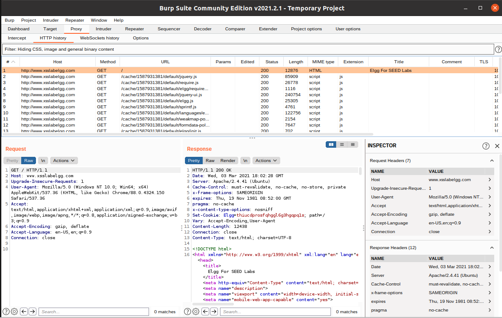
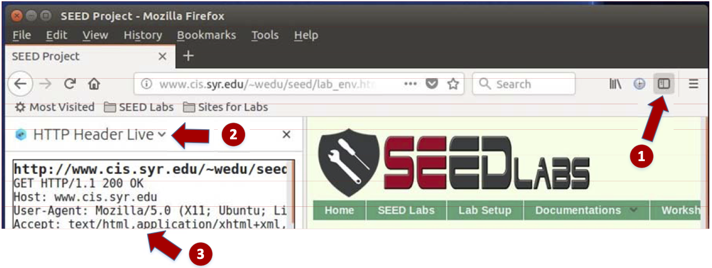
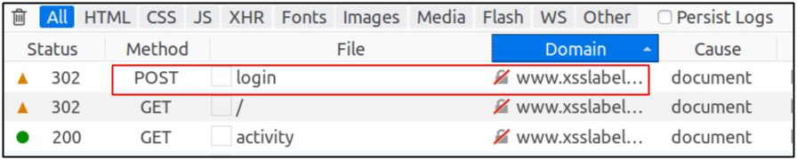
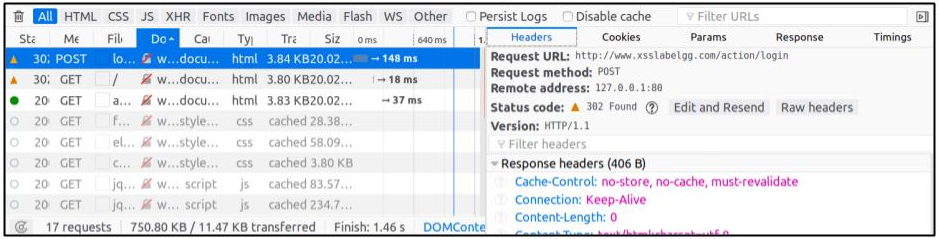
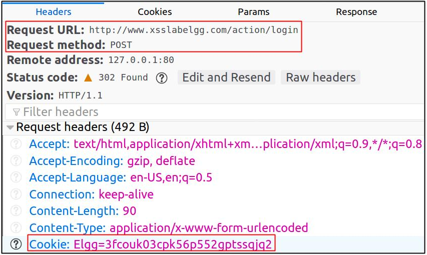
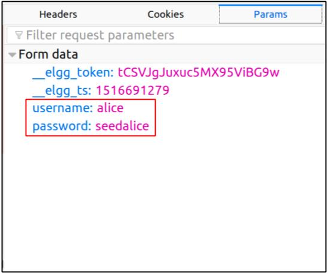

# Web Tools

Below we summarize some tools and strategies that may be useful for you when working on labs oriented around web security.
In some cases we refer you to other places to learn more, but for tools that aren't as well documented, we provide some notes here.
Please let us know if you have any questions or need assistance getting familiar with these tools and techniques.

> **NOTE:**
**Burp Suite** is an excellent tool that I (Travis) highly recommend you use.
There is a steeper learning curve to this tool, but it is extremely powerful and fun to use.
**HTTP Header Live** is the tool that SEED Labs promotes. This tool is pretty easy to learn and navigate, but it is not nearly as full-featured as a tool like Burp Suite.

## Using Your Host's Browser (+ Burp Suite) & Guest VM

Below we summarize how you can use your Host browser (e.g., Chrome) to interact with a web app running on the Guest VM.

> Thanks to Mafe Ponce for finding a great resource and sharing step-by-step instructions specific to our setup.

> This has been verified on macOS using Chrome. The idea should be similar for other OSs/browsers but your mileage may vary.

> The instructions below are adapted from
> [Access Webpage Through SSH (Ask Ubuntu Forum)](https://askubuntu.com/questions/414930/access-webpage-through-ssh) &
> [Tunneling Through a SOCKS Proxy](https://www.pentestgeek.com/lessons/sample-video-tunneling-through-socks-proxy).

#### Guest (SEED Labs VM)
- Start your VM.
- Start the webserver/mysql database running within the VM for this lab!

#### Host
- In a terminal type:
  ```bash
  ssh seed -D 4321 -C -N
  # NOTE: Assumes your ssh config file is configured to allow passwordless ssh
  # NOTE: This terminal will block so you need to open another terminal to ssh into your VM normally
  ```
- To proxy traffic through Burp Proxy and _then_ to the VM:
  - Open Burp Suite and navigate to the **User options** Tab.
  - Scroll down to the bottom. Under **SOCKS Proxy** check the boxes to "Use SOCKS proxy" and "Do DNS lookups over SOCKS proxy".
  - Also set the host to **127.0.0.1** and the port to **4321**.
  > **NOTE:** If you use Burp Proxy's built-in Chrome browser, which I recommend for ease of configuration, it binds to 127.0.0.1:8080 by default.
  > All traffic in the built-in browser will proxy traffic to Burp Suite on port 8080.
  > By configuring Burp Suite to then use a SOCKS Proxy to 127.0.0.1:4321 we are tunneling traffic to the SSH tunnel.

- In Chrome, navigate to **Settings** and search for **Proxy**.
  - Select "Open your computer's proxy settings." _>> On macOS this will direct your to System Preferences_{:.text-muted}
  - Go to **Network** $$\rightarrow$$ **Advanced...** $$\rightarrow$$ select the **Proxies** tab $$\rightarrow$$ check the **SOCKS proxy** option.
  - Enter **127.0.0.1** (IP address) and **8080** (port).
  - Click **OK** and then **Apply**.
  > **NOTE:** Here we are indicating that all of our Host's web traffic should be proxied through 127.0.0.1:8080,
  > which is where our Burp Proxy is running. Burp will then pass traffic it receives to the SSH tunnel to your VM.
  > If you don't want to use Burp Proxy, you should set your browser to proxy traffic directly to the SSH proxy running on port 4321.

- Now use Chrome (and Burp Suite) normally!

When you are done you’ll want to go back into the proxy settings and uncheck/disable the proxy configuration and click **OK** and then **Apply**.

## Using Burp Suite to Inspect HTTP Traffic

[Burp Suite](https://portswigger.net/burp) is an extremely powerful tool designed largely for analyzing web traffic and doing security assessments of web apps.
Thus, I definitely recommend you try using this tool for our labs focused on topics in web security.
You can manually configure Burp Suite to be a proxy or use its built-in browser (Chromium), which has the proxy settings pre-configured for you;
i.e., all activity in the built-in browser will be proxied through Burp Suite by default.

While you can use Burp Suite for _many_ things, one feature you are likely to find useful is the **"Proxy"** (see the image below).
Once Burp Suite is running and you have a browser that is configured to proxy traffic through Burp Suite,
you can go into the "Proxy" tab to inspect HTTP traffic.
You can see a history and summary of all requests previously sent (top); clicking on any row will allow you to examine the details of that request and the corresponding response.
Specifically, different panes are clearly marked to show you detailed information about the HTTP "Request" (bottom left) and corresponding "Response" (bottom middle),
as well as an "Inspector" (bottom right) that captures and displays the request/response headers.
You can view and edit data here.
You can also right click on most things to view a number other options
(e.g., send a request to the "Repeater" tab so you can edit and resend a request,
send some data to the "Decoder" tab to decode/encode data using various methods,
send various requests to the "Comparer" tab to view a `diff`-like comparison of HTTP requests and responses).

There are _many_ great tutorials and resources online for using Burp Suite, so we do not include any further guides here.

If you are interested in using this tool, check out [Getting Started with Burp Suite](https://medium.com/swlh/getting-started-with-burp-suite-on-ubuntu-3c1e665122a3).


{:.text-center .m-3}

## Using "HTTP Header Live" to Inspect HTTP Headers

<!-- The version of Firefox (version 60) in our Ubuntu 16.04 VM does not support the `LiveHTTPHeader` add-on, which was used in our Ubuntu 12.04 VM.  -->
<!-- A new add-on called `"HTTP Header Live"` is used in its place.  -->
The instruction on how to enable and use the "HTTP Header Live" Firefox add-on tool is depicted in the figure below.
Just click the icon marked by (1); a sidebar will show up on the left.
Make sure that "HTTP Header Live" is selected at position (2).
Then click any link inside a web page, and all of the triggered HTTP requests will be captured and displayed inside the sidebar area marked by (3).
If you click on any HTTP request, a pop-up window will show up to display the selected HTTP request.
Unfortunately, there is a bug in this add-on tool (it is still under development);
nothing will show up inside the pop-up window unless you change its size 
(It seems that re-drawing is not automatically triggered when the window pops up, but changing its size will trigger the re-drawing).


{:.text-center .m-3}

## Using the Web Developer Tool to Inspect HTTP Headers {#web:sec:web_dev_tools}

There is another tool provided by Firefox that can be quite useful in inspecting HTTP headers.
The tool is the Web Developer Network Tool.
In this section, we cover some of the important features of the tool.
The Web Developer Network Tool can be enabled by doing the following:

- Click Firefox's top right menu $$\rightarrow$$ Web Developer $$\rightarrow$$ Network, or
- Click the "Tools" menu $$\rightarrow$$ Web Developer $$\rightarrow$$ Network

Below, we use the user login page in Elgg to show the Network Tool as it captures the HTTP POST request that was sent for a login request.


{:.text-center .m-3}

To examine details of a request, we can click on a particular HTTP request and the tool will show the information in two panes.


{:.text-center .m-3}

The details of the selected request will be visible in the right pane.
One can observe both request and response headers in the right pane.
Indeed, if we look closer we can see that there are many useful details available here.
For example, in the "Headers" tab (left) we see details such as the URL, request method, and cookie.
To check the parameters sent as part of the HTTP request, we can use the "Params" tab.
For example the other figure below (right) shows the parameters sent in the login request to Elgg, which includes the **username** and **password**.
This tool can be used to inspect other HTTP requests (e.g., GET) in a similar manner.



{:.text-center .m-3}

> **NOTE:**
The default font size of Web Developer Tools window is quite small. It
can be increased by click anywhere in the Network Tool window and then using the keyboard shortcut `ctrl-+`.

## JavaScript Debugging

We may also need to debug our JavaScript code.
Firefox's Developer Tool can also help debug JavaScript code.
For example, it can point us to the precise places where errors occur.
The following instruction shows how to enable this debugging tool:

- Click the "Tools" menu $$\rightarrow$$ Web Developer $$\rightarrow$$ Web Console, or
- use the Shift+Ctrl+K shortcut.

Once you are in the web console, click the "JS" tab.
Next, click the downward pointing arrowhead beside "JS" and ensure there is a check mark beside "Error".
If you are also interested in Warning messages, click "Warning".


{:.text-center .m-3}

If there are any errors in the code, a message will display in the console.
The line that caused the error appears on the right side of the error message in the console.
Click on the line number and you will be taken to the exact place that has the error.


{:.text-center .m-3}
